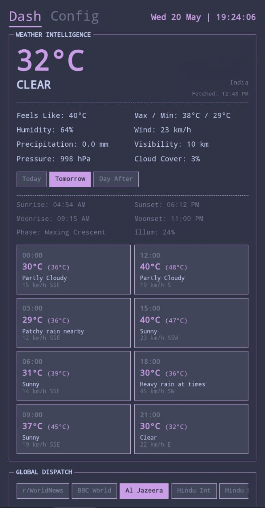
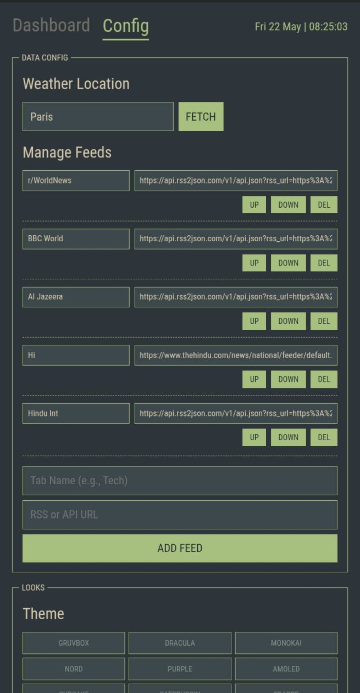

# wttr-dashboard

  

## Overview

An open source Dashboard to quickly take a look at the weather alongwith global and local news.
Inspired by the system-24 theme aesthetic.

## Screenshots

  
  
  
  

## Features

- **Simple aesthetic dashboard to see the weather and news:** By default it geolocates to show your weather but location can be set from settings too. Many news api are already added, you can remove and add more.
- **Retro terminalesque design:** Inspired by Unix customizations found online.
- **Lightweight:** Consumes only 0.05% CPU and 61KB of RAM. After all, simple apps shouldn't need more—remember, the Apollo mission operated on a computer with around 4KB of RAM!
- **Highly customizable:** Offers many themes with plans to add more customizations such as fonts, font sizes, and border colors.

## Releases

- You can download the latest apk from github releases section here: [Releases](https://github.com/ronynn/dash/releases)

## Licenses
Karui is being developed under the GPLv3 License.

## Follow the Development

Join us (my thought process and approach with other's opinions) on telegram: <https://t.me/karuifoss>
This app has been primarily made on my phone with Acode editor with alpine linux terminal, app compiled thanks to github actions.

Github Issues are the fastest way to get in touch, for other means there's gitlab, bluesky, and my dev.to account, all linked in my account page on github and [homepage](https://ronynn.github.io).

If you like the app, don't forget to leave a star ⭐ here on github and let me know your suggestions!
